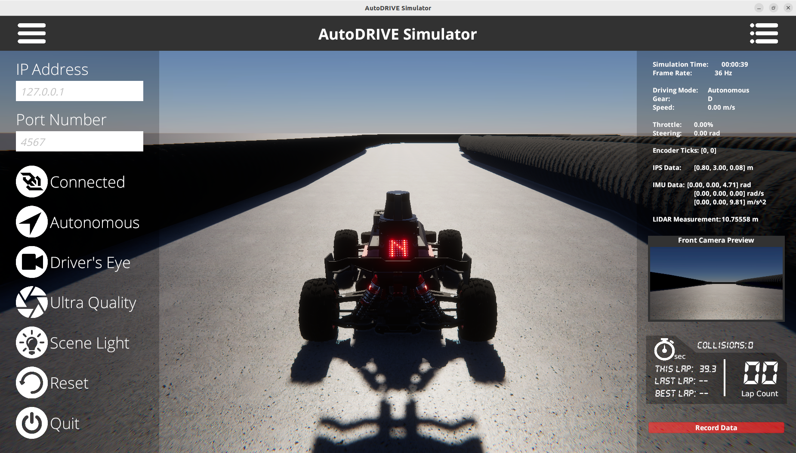
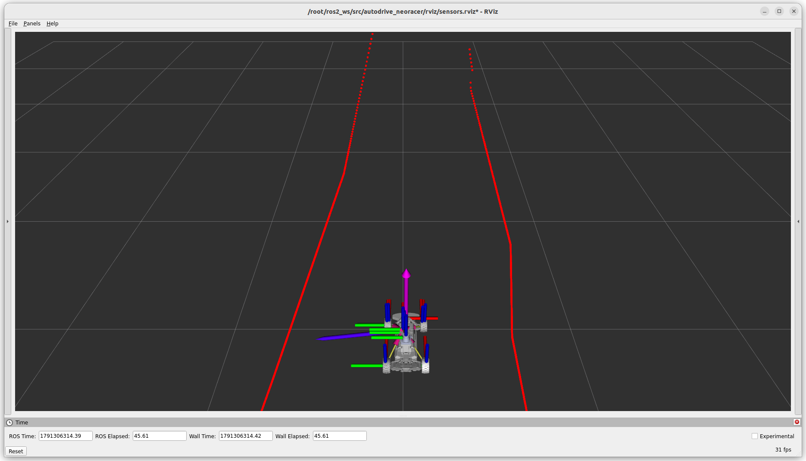

# Clemson University AuE-4930/6930 Tech Stack


[](https://hub.docker.com/r/autodriveecosystem/autodrive_neoracer_sim/)
[](https://hub.docker.com/r/autodriveecosystem/autodrive_neoracer_sim/)
[](https://hub.docker.com/r/autodriveecosystem/autodrive_neoracer_api/)
[](https://hub.docker.com/r/autodriveecosystem/autodrive_neoracer_api/)

> [!NOTE]
> - The setup has been extensively tested on [Ubuntu](https://ubuntu.com). Additionally, it has been tested to work on [Windows (WSL)](https://learn.microsoft.com/en-us/windows/wsl) and [macOS](https://www.apple.com/os/macos), with [known limitations](docker_limitations.md).
> - It is assumed that [Docker](https://docs.docker.com/engine/install) is installed.
> - It is assumed that if the Docker container is to take advantage of an NVIDIA GPU, the host machine has been properly configured by installing the necessary NVIDIA GPU drivers and the [NVIDIA Container Toolkit](https://docs.nvidia.com/datacenter/cloud-native/container-toolkit/latest/index.html).
> - We have worked with the [ACDS team (RCDE group at CCIT)](https://www.clemson.edu/ccit/research/service-areas/acds.html) to set up a [Classroom OnDemand](palmetto_ondemand.md) resource within the [Palmetto 2 Cluster](https://docs.rcd.clemson.edu/palmetto/about) to conveniently launch a desktop session for the class via a preconfigured environment (as an alternative to your own laptops if you are facing technical issues/limitations).

## AutoDRIVE Simulator Container



> [!NOTE]
> The simulator executable must be placed inside [`/autodrive_simulator`](/autodrive_simulator) directory. This repository ships with an examplar working simulator executable, which can be updated as necessary.

### Build:

```bash
docker build --tag autodriveecosystem/autodrive_neoracer_sim:<TAG> -f autodrive_simulator.Dockerfile .
```

### Run:

```bash
xhost local:root
docker run --name autodrive_neoracer_sim --rm -it --network=host --ipc=host -v /tmp/.X11-unix:/tmp/.X11-unix:rw --env DISPLAY --privileged --gpus all autodriveecosystem/autodrive_neoracer_sim:<TAG>
```

### Push:

1. Run the image you created in the previous step inside a container:
```bash
xhost local:root
docker run --name autodrive_neoracer_sim --rm -it --network=host --ipc=host -v /tmp/.X11-unix:/tmp/.X11-unix:rw --env DISPLAY --privileged --gpus all autodriveecosystem/autodrive_neoracer_sim:<TAG>
```

2. In a new terminal window, list all containers and make a note of the desired `CONTAINER ID`:
```bash
docker ps -a
```

3. Commit changes to Docker Hub:
```bash
docker commit -m "AutoDRIVE-Clemson-University-Course" -a "AutoDRIVE Ecosystem" <CONTAINER ID> autodriveecosystem/autodrive_neoracer_sim:<TAG>
```

4. Login to Docker Hub:
```bash
docker login
```

5. Push the container to Docker Hub, once done, you should be able to see your repository on Docker Hub:
```bash
docker push autodriveecosystem/autodrive_neoracer_sim:<TAG>
```

## AutoDRIVE Devkit Container



> [!NOTE]
> The devkit package(s) must be placed inside [`/autodrive_devkit`](/autodrive_devkit) directory. This repository ships with an examplar working devkit package, which can be updated as necessary.

### Build:

```bash
docker build --tag autodriveecosystem/autodrive_neoracer_api:<TAG> -f autodrive_devkit.Dockerfile .
```

### Run:

```bash
xhost local:root
docker run --name autodrive_neoracer_api --rm -it --network=host --ipc=host -v /tmp/.X11-unix:/tmp/.X11-unix:rw --env DISPLAY --privileged --gpus all autodriveecosystem/autodrive_neoracer_api:<TAG>
```

### Push:

1. Run the image you created in the previous step inside a container:
```bash
xhost local:root
docker run --name autodrive_neoracer_api --rm -it --network=host --ipc=host -v /tmp/.X11-unix:/tmp/.X11-unix:rw --env DISPLAY --privileged --gpus all autodriveecosystem/autodrive_neoracer_api:<TAG>
```

2. In a new terminal window, list all containers and make a note of the desired `CONTAINER ID`:
```bash
docker ps -a
```

3. Commit changes to Docker Hub:
```bash
docker commit -m "AutoDRIVE-Clemson-University-Course" -a "AutoDRIVE Ecosystem" <CONTAINER ID> autodriveecosystem/autodrive_neoracer_api:<TAG>
```

4. Login to Docker Hub:
```bash
docker login
```

5. Push the container to Docker Hub, once done, you should be able to see your repository on Docker Hub:
```bash
docker push autodriveecosystem/autodrive_neoracer_api:<TAG>
```

## Helpful Docker Tips

1. To access the container while it is running, execute the following command in a new terminal window to start a new bash session inside the container:
```bash
docker exec -it <CONTAINER NAME> bash
```

2. To exit the bash session(s), simply execute:
```bash
exit
```

3. To kill the container, execute the following command:
```bash
docker kill <CONTAINER NAME>
```

4. To remove the container, simply execute:
```bash
docker rm <CONTAINER NAME>
```

5. To copy files from container to the host workstation, simply execute:
```bash
docker cp <CONTAINER_NAME_OR_ID>:/container/path/to/file.extension /home/<USERNAME>/path/on/host/workstation
```

6. Running or caching multiple docker images, containers, volumes, and networks can quickly consume a lot of disk space. Hence, it is always a good idea to frequently check Docker disk utilization:
```bash
docker system df
```

7. To avoid utilizing a lot of disk space, it is a good idea to frequently purge docker resources such as images, containers, volumes, and networks that are unused or dangling (i.e. not tagged or associated with a container). There are several ways with many options to achieve this, please refer to appropriate documentation. The easiest way (but a potentially dangerous one) is to use a single command to clean up all the docker resources (dangling or otherwise):
```bash
docker system prune -a
```

8. After Docker Desktop is installed, Docker CLI commands are by default forwarded to Docker Desktop instead of Docker Engine, and hence you cannot connect to the Docker daemon without running Docker Desktop. In order to avoid this, just switch to the `default` Docker context:
```bash
docker context ls
docker context use default
```
> [!NOTE]
> It is not recommended to use Docker Desktop on the Linux operating system. This is because Docker Desktop creates a virtual machine based on Linux, which is first of all not needed for native (host) Linux OS, and secondly, it sometimes does not expose the necessary access ports for the containers (e.g., trouble with GPU access).

## Citation

We encourage you to read and cite the following papers if you use any part of the competition framework for your research:

#### [AutoDRIVE: A Comprehensive, Flexible and Integrated Digital Twin Ecosystem for Enhancing Autonomous Driving Research and Education](https://arxiv.org/abs/2212.05241)
```bibtex
@article{AutoDRIVE-Ecosystem-2023,
author = {Samak, Tanmay and Samak, Chinmay and Kandhasamy, Sivanathan and Krovi, Venkat and Xie, Ming},
title = {AutoDRIVE: A Comprehensive, Flexible and Integrated Digital Twin Ecosystem for Autonomous Driving Research & Education},
journal = {Robotics},
volume = {12},
year = {2023},
number = {3},
article-number = {77},
url = {https://www.mdpi.com/2218-6581/12/3/77},
issn = {2218-6581},
doi = {10.3390/robotics12030077}
}
```
This work has been published in **MDPI Robotics.** The open-access publication can be found on [MDPI](https://doi.org/10.3390/robotics12030077).

#### [AutoDRIVE Simulator: A Simulator for Scaled Autonomous Vehicle Research and Education](https://arxiv.org/abs/2103.10030)
```bibtex
@inproceedings{AutoDRIVE-Simulator-2021,
author = {Samak, Tanmay Vilas and Samak, Chinmay Vilas and Xie, Ming},
title = {AutoDRIVE Simulator: A Simulator for Scaled Autonomous Vehicle Research and Education},
year = {2021},
isbn = {9781450390453},
publisher = {Association for Computing Machinery},
address = {New York, NY, USA},
url = {https://doi.org/10.1145/3483845.3483846},
doi = {10.1145/3483845.3483846},
booktitle = {2021 2nd International Conference on Control, Robotics and Intelligent System},
pages = {1–5},
numpages = {5},
location = {Qingdao, China},
series = {CCRIS'21}
}
```
This work has been published at **2021 International Conference on Control, Robotics and Intelligent System (CCRIS).** The publication can be found on [ACM Digital Library](https://dl.acm.org/doi/abs/10.1145/3483845.3483846).
